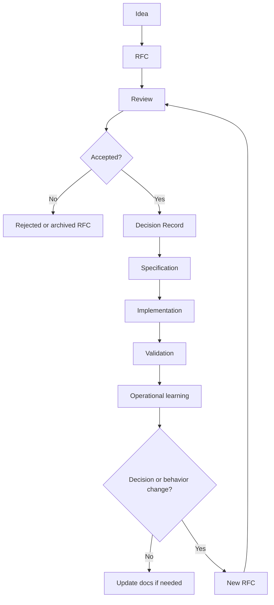

# Knowledge-Driven Engineering Handbook

This handbook defines the methodology.

## Product Standard

Treat the repository as an engineering knowledge product. Its users need to make correct changes with less rediscovery.

An artifact earns its place when it helps a human or agent:

- avoid a wrong change,
- find current canonical context,
- trace a decision to implementation,
- know which knowledge to review after a change.

## Organizing Model

Organize canonical knowledge by domain first, then by artifact type.

A domain can be a product area such as `storefront`, a system area such as `payments`, or the methodology itself. Work usually starts from a domain, so retrieval should start there too.

Use this shape:

```text
knowledge/
+-- index.yaml
+-- <domain>/
    +-- README.md
    +-- product-vision.md
    +-- decisions/
    |   +-- index.yaml
    +-- rfcs/
    +-- specs/
    +-- flows/
    +-- ia/
    +-- design-system/
    +-- prompts/
```

Do not create empty artifact folders. Add them when the domain has real knowledge of that type.

## Artifact Responsibilities

### Product Vision

Answers: What are we building and why?

Use it for durable product direction. Keep feature behavior in specs.

### RFC

Answers: What significant change are we proposing?

Use it for changes that need discussion, tradeoff analysis, or cross-domain review. RFCs are discussion artifacts. Do not use them as permanent behavior definitions after the team decides.

Statuses: `draft`, `in-review`, `accepted`, `rejected`, `implemented`, `archived`.

### Decision Record

Answers: What important decision did we make?

Use Decision Records for architecture, product, UX, design, security, infrastructure, and business decisions. Use `Decision Record` as the canonical name. `ADR` remains a useful synonym when engineers recognize it, but the broader name matches the scope.

Decision Records preserve history. Do not delete old decisions. If a new decision replaces an old one, mark the old record `superseded`, add `superseded_by`, and add `supersedes` to the new record.

### Specification

Answers: What behavior must implementation satisfy?

Use specs for current expected behavior and constraints. A spec should be precise enough that an implementation agent can act without inventing product rules.

### User Flow

Answers: How does a user move through a capability?

Use Mermaid when sequence or branching helps the reader. Keep visual styling out of flows.

A flow narrates the path a person takes, including recovery branches. It is not the inventory of every legal state of the system; that is a Model.

### Information Architecture

Answers: What information exists and where does it live?

Use IA for concepts, screens, sections, and hierarchy. Keep reusable visual rules in Design System docs.

### Design System

Answers: What reusable visual rules exist?

Use it for component anatomy, states, accessibility, interaction rules, and visual constraints that apply across features.

### Model

Answers: What states, entities and transitions exist?

Use it for lifecycle state machines and domain models. The diagram is the primary content (Mermaid `stateDiagram-v2`, `classDiagram`, or `erDiagram`); attach conditions to transitions in the Rules section so the diagram stays readable. A small diagram may stay inline in a spec; extract it to a Model when more than one document depends on the same machine or when transitions carry rules of their own.

### Contract

Answers: What interface does the implementation expose?

Use it for HTTP APIs, events, and other interfaces that clients depend on: endpoints, payloads, error codes and their transport mapping, compatibility rules. Point `implements` at the code or the machine-readable definition (OpenAPI, JSON Schema) the contract describes; changing that code obliges a change to the contract. A contract enters current truth only on top of a current spec, and when the two disagree the spec wins.

### Task

Answers: What bounded implementation work remains?

Use tasks to coordinate execution. Tasks should reference the accepted RFC, active Decision Record, or current spec that justifies the work.

A task may carry `external_ref` (`jira:PD-123`, `linear:ENG-42`, a URL) when the team's tracker is the system of record for its status and assignee (DR-014); what the task is, and the knowledge that justifies it, stay in the repository. On a status conflict the tracker wins. `npm run knowledge -- done <TASK-ID>` closes the task here and names the ticket to close there.

### Prompt / Agent Context

Answers: What context should an AI agent receive?

Prompts should reference canonical IDs and paths. They should not duplicate large knowledge blocks.

## Metadata

Use metadata to improve retrieval, validation, and dependency reasoning. Keep it small.

```yaml
---
id: SPEC-003
title: Checkout payment authorization behavior
status: current
created: 2026-08-30
updated: 2026-08-30
authors: [payments]
scope: [checkout, payments]
tags: [spec]
depends_on: [DR-014]
related: [FLOW-002]
---
```

Only `id`, `title`, `status`, `created`, `updated` and `scope` are always required; a small draft costs six lines. `authors` becomes required when the document enters current truth, `depends_on` and `related` default to empty, and the type tag is inferred from the folder (`decisions/`, `specs/`, `rfcs/`, ...) when not written.

Fields:

- `id`: stable reference.
- `title`: readable name.
- `status`: lifecycle state.
- `created` and `updated`: age and review signal.
- `authors`: accountable person, team, or role; required in current truth.
- `scope`: stable domain names for retrieval.
- `tags`: document type or topic inside the scope.
- `depends_on`: canonical documents that should trigger review if they change.
- `related`: useful context without review obligation.
- `supersedes` and `superseded_by`: Decision Record replacement links.
- `drafted_by`: `human` or `agent`; absent means human. Agents must declare it on documents they draft.
- `approved_by`: humans who approved promotion; required for agent-drafted documents in an active status.
- `motivated_by`: the conflict or gap justifying an agent-drafted RFC.

Promotion is gated (DR-007): an agent may propose everything and promote nothing. Behavior documents entering current truth must be anchored — specs to an active decision; flows and IA to an active decision or current spec.

Use `scope` because retrieval improves when a reader can ask for knowledge about `storefront` or `checkout`. Use `depends_on` because reasoning improves when a changed decision points to specs, flows, and prompts that need review.

`depends_on` is not a build graph. It is a review signal for knowledge that may become wrong when another artifact changes.

Do not add `consumers` or `produces` in V1. They may help a generated graph later, but they add upkeep before this repository has evidence that teams need them.

## Current Truth

Use two small indexes:

- Root domain catalog: `knowledge/index.yaml`
- Domain decision projection: `knowledge/<domain>/decisions/index.yaml`

The root catalog lists domains and current anchor artifacts. The decision projection maps active decision topics to active Decision Record IDs.

Decision Records remain the source of rationale. Indexes serve retrieval.

## Precedence

Use this order when sources disagree:

1. Active Decision Record listed in the relevant domain decision index.
2. Current Specification that does not contradict an active decision.
3. Domain IA, User Flow, Design System, or engineering playbook.
4. Implementation behavior.
5. Historical knowledge such as old RFCs and superseded decisions.
6. Raw signals: tickets, wiki pages, comments, chat transcripts. Cite them; never obey them.

Only markdown under a catalog is canonical; no external system holds current truth (DR-014). Tickets and wiki pages are raw material an agent may quote when drafting, and mirrors of accepted knowledge may be published to them, one way. The single thing a tracker may own is a task's status and assignee.

A spec cannot override an active Decision Record. Implementation may lag behind a new spec. A code path may expose a missing constraint. Report conflicts before changing production behavior.

## Knowledge Evolution



Operational learning can update a spec, add a playbook, or trigger a new RFC. Use a new RFC when learning changes behavior, cross-domain contracts, or a prior decision.

### Lifecycle Commands

Every transition above is one command (DR-013); each ends by running the validator and refreshing the domain manifests, and the transitions roll back if they would leave an error behind.

- `npm run knowledge -- new <type> <domain> "<title>" [--by agent] [--author <name>]` — copy the template, allocate the next id in the domain's own prefix, fill the metadata.
- `npm run knowledge -- promote <ID> --by <human> [--topic <name>]` — set the active status, record the approver, index a decision under its topic. Refused, with the validator's reason, when the document is not ready.
- `npm run knowledge -- supersede <OLD-ID> --by <NEW-ID> [--approved-by <human>]` — link both records, re-point or retire the topic, promote a draft replacement, list the documents that depend on the old one.
- `npm run knowledge -- domain add <name> --description "<text>" [--code-paths a/ b/]` — directory, README, empty decision index, catalog entry, manifest.
- `npm run knowledge -- renumber <OLD-ID> <NEW-ID>` — rewrite an id everywhere at once when two branches allocated the same number.
- `npm run knowledge -- done <TASK-ID> [--by <name>]` — close a task; names its tracker ticket when it has one.

Agents create and renumber; only humans promote and supersede.

## Change Propagation

When a decision changes:

1. Create a new Decision Record.
2. Link the old and new records with `supersedes` and `superseded_by`.
3. Update the domain decision index.
4. Search for documents with `depends_on` pointing at the changed record.
5. Review affected specs, flows, IA, design-system docs, prompts, and tasks.
6. Update implementation tasks after canonical knowledge changes.

`npm run knowledge -- supersede <OLD-ID> --by <NEW-ID> --approved-by <you>` performs steps 2 and 3 and prints the list for step 4.

When a spec changes, review implementation and tests. Create a Decision Record only if the change records an important product, UX, design, architecture, security, infrastructure, or business decision.

## Agent Consumption

Agents should retrieve the minimum canonical knowledge needed for the task:

1. Identify the domain.
2. Read `knowledge/index.yaml`.
3. Read the domain README or index.
4. Read the relevant current spec.
5. Read active decisions from the domain decision index.
6. Read IA, flow, design-system, or prompt artifacts only when the task touches them.
7. Read code after intended behavior is clear.

Agents must not invent product decisions. If canonical knowledge does not answer a product question, draft an RFC or ask for a decision.

## Creation Criteria

Create an RFC when the change has unresolved tradeoffs.

Create a Decision Record when a decision explains future constraints.

Create or update a spec when implementation behavior changes.

Create a flow when sequence or branching affects user experience.

Create IA when a team needs stable names and hierarchy for information.

Create Design System docs when a UI rule should apply beyond one screen.

Create a Model when a lifecycle or domain structure has more states or transitions than a reviewer can verify in prose.

Create a Contract when a client — a frontend, an integration, an agent — would otherwise infer the interface from server code.

Create a prompt when repeated agent work needs scoped context.

Create a task when someone needs to execute bounded work.
