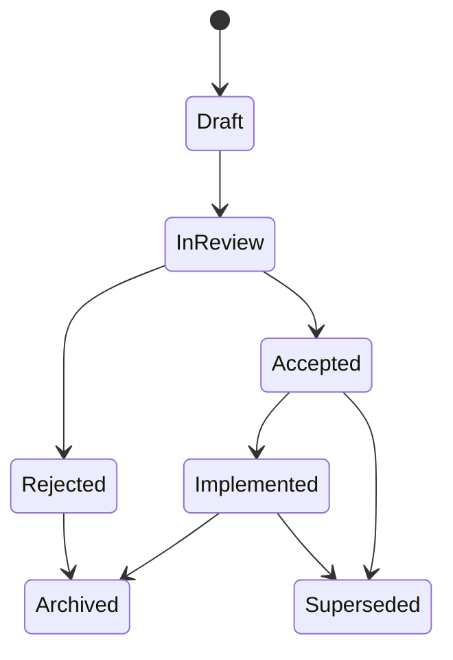

# Knowledge-Driven Engineering Handbook

This handbook is the canonical guide for the methodology.

## Principles

- Each artifact answers one primary question.
- Historical records stay intact.
- Current truth must be cheap to find.
- Agents should retrieve scoped context for the task in front of them.
- Documentation should change when it prevents rediscovery, wrong implementation, or repeated debate.
- A small accurate document beats a complete stale document.

## Artifact Responsibilities

### Product Vision

Answers: What are we building, for whom, and why?

Use a Product Vision when a team needs durable product context. Keep it strategic. Do not use it for feature-level behavior, task planning, or design details.

### RFC

Answers: What significant change are we proposing?

Create an RFC for changes that need discussion, involve tradeoffs, affect multiple artifacts, or may change product behavior. RFCs hold proposal context, alternatives, risks, and open questions.

Typical statuses:

- `draft`
- `in-review`
- `accepted`
- `rejected`
- `implemented`
- `archived`

An accepted RFC may produce Decision Records, specs, UX flows, IA updates, design-system changes, and tasks.

### Decision Record

Answers: What important decision did we make and why?

Use `Decision Record` as the canonical term. `ADR` remains acceptable when teams already use that phrase, but this methodology records more than architecture.

Decision Records can cover:

- architecture,
- product,
- UX,
- design,
- security,
- infrastructure,
- business rules.

Decision Records are append-oriented history. Do not rewrite rationale after the fact. Metadata corrections and status changes are allowed. If a later decision replaces an earlier one, mark the old record `superseded`, add `superseded_by`, and add `supersedes` to the new record.

### Specification

Answers: What behavior and constraints must the implementation satisfy?

Write a spec after the team has enough decision context to define expected behavior. A spec should be precise enough that an implementation agent can act without inventing product rules.

Specs may change as current truth changes. When a spec conflicts with an active Decision Record, report documentation drift and resolve the conflict before relying on the spec.

### User Flow

Answers: How does a user move through a capability?

Use User Flows for product paths, decisions, and recovery states. Prefer Mermaid when a diagram helps readers see sequence or branching. Avoid decorative diagrams.

### Information Architecture

Answers: What information, screens, sections, concepts, and hierarchy exist?

IA defines product structure without visual styling. Keep component colors, spacing, animation, and interaction rules in Design System artifacts.

### Design System

Answers: What reusable visual and interaction rules must UI implementations follow?

Use Design System artifacts for component behavior, visual constraints, accessibility expectations, states, and reuse rules. Keep one-off feature behavior in specs.

### Task

Answers: What bounded implementation work needs completion?

Tasks should derive from accepted RFCs, active decisions, or current specs. A task can coordinate work, but it should not become the source of product truth.

### Prompt / Agent Context

Answers: What context or instructions should an AI agent receive for a specific kind of work?

Prompts should reference canonical knowledge by ID or path. They should not duplicate large sections of product, design, or engineering documentation.

## Metadata

Use YAML frontmatter only when metadata improves discovery or validation.

Recommended fields:

```yaml
---
id: DR-004
title: Use Decision Record as the general decision artifact
status: accepted
created: 2026-08-30
updated: 2026-08-30
authors: [engineering]
tags: [methodology, decisions]
related: [RFC-001]
supersedes: [DR-001]
superseded_by: []
---
```

Field rules:

- `id` gives the artifact a stable reference.
- `title` should match the document heading.
- `status` enables validation and lifecycle tracking.
- `created` and `updated` help readers understand age.
- `authors` identifies the accountable person, team, or role.
- `tags` support scoped discovery.
- `related` links nearby context without embedding it.
- `supersedes` and `superseded_by` apply to Decision Records.

Avoid fields such as `consumers` or `produces` in V0. They can help automated graph tooling, but they also create metadata churn. Add them later only if manual discovery fails in real project use.

## Lifecycle



Not every artifact uses every status. Product Vision and Design System docs may use `current`. RFCs move through proposal states. Decision Records use `accepted`, `superseded`, and sometimes `rejected` for recorded decisions the team declined.

## RFC, Decision, Spec, Task

Use these boundaries:

- RFC explores a change.
- Decision Record records what the team decided.
- Spec defines required behavior.
- Task tracks bounded implementation work.

Do not use tasks to settle product truth. Do not use specs to preserve debate. Do not use RFCs as permanent behavior definitions after the team has decided.

## Current Truth And Historical Truth

Decision Records preserve historical truth. The decision index provides current truth for agents and humans who need to know which decisions apply now.

Use `knowledge/decisions/index.yaml`:

```yaml
current:
  methodology.decision-record-naming: DR-004
```

The index maps a stable topic key to the active Decision Record ID. It must not duplicate rationale. Read the target Decision Record when you need reasoning.

When a decision changes:

1. Create a new Decision Record.
2. Add `supersedes` to the new record.
3. Update the old record to `status: superseded`.
4. Add `superseded_by` to the old record.
5. Update the decision index to point at the new active record.
6. Update specs, IA, flows, design-system docs, prompts, and tasks that relied on the old decision.

## Precedence

Use this order when documents conflict:

1. Active accepted or implemented Decision Record listed in the decision index.
2. Current Specification that does not contradict an active decision.
3. Domain-specific canonical documentation, such as IA or Design System docs.
4. Implementation behavior.
5. Historical documentation, including superseded decisions and old RFCs.

This order does not mean documentation always beats code. A newly accepted spec may describe intended behavior that implementation has not reached yet. Existing code may reveal a missing constraint. Agents must report conflicts instead of changing production behavior without an explicit decision.

## Agent Consumption Rules

Agents should gather the smallest useful context:

1. Identify the product area, capability, component, or subsystem.
2. Read the relevant spec, if one exists.
3. Read active decisions from the decision index for that area.
4. Read domain docs that match the change, such as IA for navigation or Design System for UI components.
5. Read implementation only after establishing the intended behavior.

Agents should not read the whole `knowledge/` tree by default. They should follow IDs, paths, tags, and direct references.

Agents must not invent product decisions. If canonical docs do not answer a product question, they should ask for a decision or draft an RFC.

## Maintenance Rules

- Update docs in the same change set as behavior changes when practical.
- Prefer editing current specs over creating parallel specs.
- Keep superseded Decision Records in place.
- Add a new Decision Record when a team changes a prior decision.
- Archive RFCs when they no longer help readers understand current or recent work.
- Remove links that stop helping discovery.
- Run `npm run knowledge:check` before merging documentation changes.

