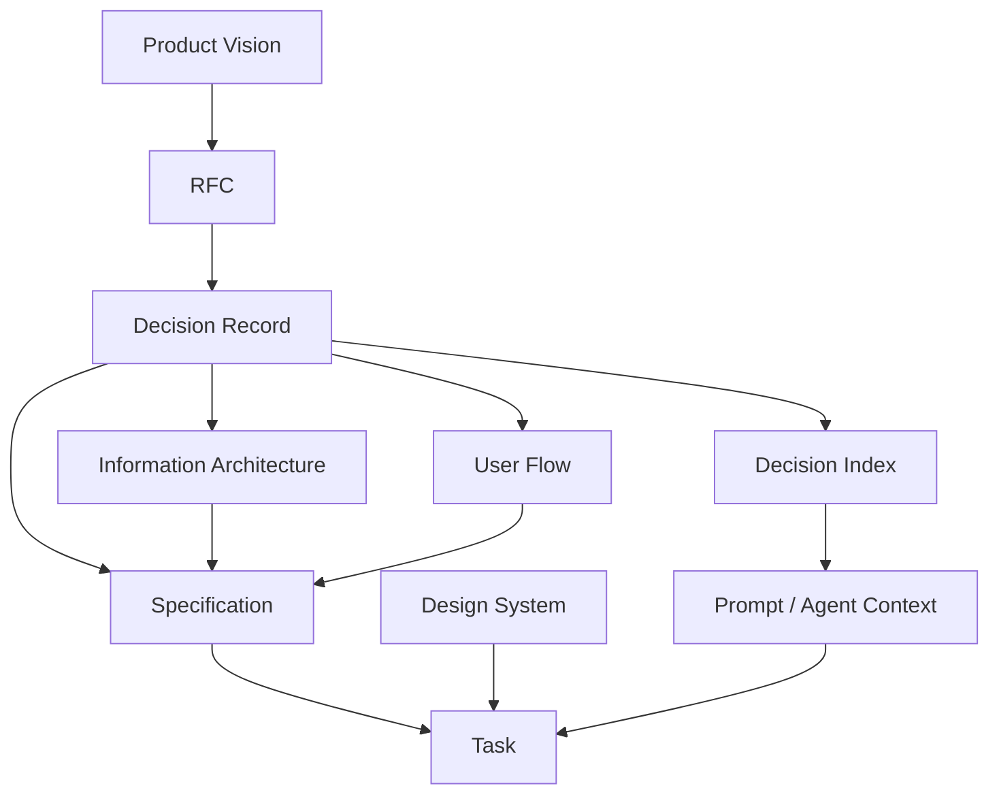

# Knowledge-Driven Engineering

Knowledge-Driven Engineering is a lightweight way to keep product, design, architecture, and implementation knowledge explicit.

The core thesis:

> Code is one representation of system knowledge. Product intent, design constraints, architectural decisions, and engineering rules should also be versioned, traceable, and readable by humans and AI agents.

This repository defines the V0 methodology, templates, examples, and a small validator. It starts private so the method can be tested in a real product before anyone optimizes it for public adoption.

## Problem

Software teams lose time when important knowledge lives only in code, chats, tickets, or memory. Agents lose more time because they cannot ask the original decision-makers what happened. They infer intent from implementation, rediscover context, and risk changing behavior that exists for a reason.

Knowledge-Driven Engineering addresses that failure mode by separating:

- proposals from decisions,
- historical decisions from current truth,
- behavior specifications from implementation tasks,
- visual rules from product information architecture.

The method favors small documents with clear boundaries over large documents that mix discussion, decisions, specs, and task lists.

## When To Use It

Use this method when a project has enough product or technical surface area that future contributors will need context before changing behavior. It fits teams using AI-assisted engineering, systems with complex business rules, and products where design, product, and engineering decisions interact.

It is overkill for throwaway prototypes, single-purpose scripts, and projects where code comments explain all meaningful behavior.

## Artifact Types

| Artifact | Primary question | Role |
| --- | --- | --- |
| Product Vision | What are we building, for whom, and why? | Long-lived product context. |
| RFC | What significant change are we proposing? | Proposal, tradeoffs, open questions. |
| Decision Record | What important decision did we make and why? | Historical record for product, UX, design, architecture, security, infrastructure, and business rules. |
| Specification | What behavior and constraints must implementation satisfy? | Current expected behavior after decisions have been made. |
| User Flow | How does a user move through a capability? | Step-by-step product experience, often with Mermaid. |
| Information Architecture | What concepts, screens, and hierarchy exist? | Product structure separate from visual styling. |
| Design System | What reusable visual and interaction rules apply? | UI implementation constraints. |
| Task | What bounded implementation work needs completion? | Execution unit derived from canonical knowledge. |
| Prompt / Agent Context | What scoped context should an AI agent receive? | Operational instructions that reference canonical knowledge. |

## Information Flow



The Decision Record keeps rationale. The decision index only points to active decisions.

## Example Lifecycle

```mermaid
flowchart LR
    Idea[Idea] --> DraftRFC[Draft RFC]
    DraftRFC --> Review[In Review]
    Review --> Accepted[Accepted RFC]
    Accepted --> Decision[Decision Record]
    Decision --> Spec[Specification]
    Spec --> Task[Implementation Task]
    Task --> Code[Code Change]
    Code --> Verify[Validation]
    Verify --> Implemented[Mark RFC Implemented]
```



A team might propose that food categories should appear before restaurants on a storefront. They write an RFC to explore the change, accept a Decision Record after review, update the information architecture and UX flow, write a specification, then create implementation tasks.

See [examples/food-delivery](examples/food-delivery/README.md).

## Repository Layout

```text
.
+-- AGENTS.md
+-- HANDBOOK.md
+-- CONTRIBUTING.md
+-- knowledge/
|   +-- decisions/
|   +-- design/
|   +-- engineering/
|   +-- product/
+-- prompts/
+-- templates/
+-- examples/
+-- tools/
+-- tests/
```

The structure stays shallow on purpose. Add directories only when they improve discovery.

## Validation

Run:

```bash
npm run knowledge:check
```

The V0 validator checks IDs, statuses, cross-references, supersession metadata, and decision index targets.
