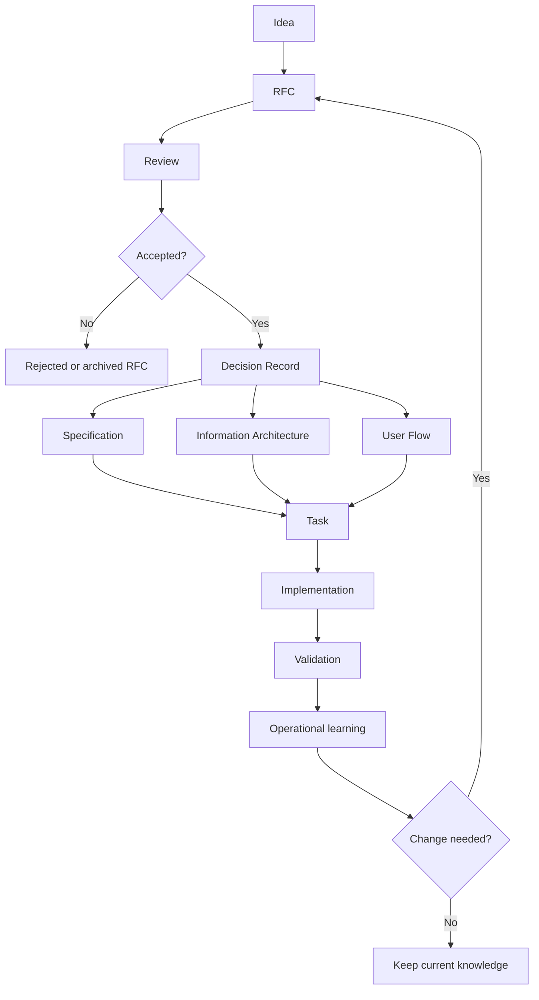

# Knowledge-Driven Engineering

Knowledge-Driven Engineering is a lightweight engineering knowledge system for teams that mix humans and AI agents.

Its goal is reducing engineering mistakes while minimizing cognitive load. Documentation is one representation of the knowledge; the product is the retrieval system that helps engineers and agents find the right context before changing behavior.

## Quick Start

From the root of your repository:

```bash
curl -fsSL https://raw.githubusercontent.com/emafriedrich/knowledge-driven-engineering/main/install.sh | bash -s -- <your-first-domain>
npm run knowledge:check
```

Then seed current truth: copy `templates/decision-record.md` into `knowledge/<your-first-domain>/decisions/`, record one decision your team already made, and list it in that domain's `decisions/index.yaml`.

The installer is idempotent and never overwrites existing files. It adds the validator and companion tools, the templates, a domain scaffold, a CI workflow, Claude Code hooks, and a KDE section in your `AGENTS.md`. Details in [ADOPTING.md](ADOPTING.md).

## Core Thesis

Code represents part of system knowledge. Product intent, design constraints, architecture, behavior rules, operational lessons, and tradeoffs also need versioned, traceable, retrievable representations.

## Problem

Teams lose context when decisions live in code, chats, issue comments, or memory. A Staff Engineer joining after six months has to reconstruct intent. An implementation agent has to infer product rules from implementation.

Knowledge-Driven Engineering reduces that cost by separating:

- discussion from decisions,
- historical decisions from current truth,
- behavior requirements from implementation tasks,
- information architecture from visual design rules.

## When To Use It

Use this method when a project has enough product or technical surface area that contributors need context before changing behavior. It fits products with business rules, cross-functional design/engineering tradeoffs, or AI-assisted implementation.

Skip it for throwaway prototypes, single-purpose scripts, and codebases where local code comments explain the meaningful behavior.

To use the method in your own project, see [ADOPTING.md](ADOPTING.md).

## Prior Art And Delta

The pieces are deliberately familiar: Decision Records (Nygard's ADRs), RFC processes, spec-driven development, the AGENTS.md convention, and domain partitioning from DDD. Knowledge-Driven Engineering is an operational synthesis of that prior art for teams where agents implement, and its delta is the parts that tradition leaves out:

- **A computable projection of current truth.** ADRs solve history; the decision indexes answer "which decisions apply today?" in a form a machine consumes.
- **Explicit precedence between sources**, plus the rule to report conflicts instead of resolving them silently. Spec-driven development says to write specs; it does not say what wins when spec, decision, and code disagree.
- **Consumption rules for agents**: a bounded retrieval order instead of "read the docs".
- **Knowledge integrity as CI.** The validator lints the knowledge graph the way code is linted.

The substrate itself — markdown files with YAML frontmatter, linked into a graph, versioned in git, consumable by agents — is shared with the [Open Knowledge Format](https://github.com/GoogleCloudPlatform/knowledge-catalog/tree/main/okf) (Google Cloud, 2026), which validates the pattern for describing data resources. OKF is deliberately minimally opinionated; Knowledge-Driven Engineering operates the layer OKF leaves out: lifecycle, current truth, precedence, and governance of agent-authored knowledge.

## Conceptual Model

The primary organizing unit is the domain: a product area, system area, or methodology area where people perform work.

Inside a domain, artifacts keep different responsibilities:

| Artifact | Primary question |
| --- | --- |
| Product Vision | What are we building and why? |
| RFC | What significant change are we proposing? |
| Decision Record | What important decision did we make? |
| Specification | What behavior must implementation satisfy? |
| User Flow | How does a user move through a capability? |
| Information Architecture | What information exists and where does it live? |
| Design System | What reusable visual rules exist? |
| Task | What bounded implementation work remains? |
| Prompt / Agent Context | What context should an AI agent receive? |

Domains optimize retrieval. Artifact types protect meaning.

## Knowledge Flow



## Current Truth

Decision Records preserve history. Domain indexes project current truth.

- `knowledge/index.yaml` tells a reader which domains exist and which current artifacts anchor each domain.
- `knowledge/<domain>/decisions/index.yaml` maps decision topics to active Decision Records.

Indexes point to canonical records. They do not copy rationale.

## Repository Layout

```text
.
+-- AGENTS.md
+-- ADOPTING.md
+-- HANDBOOK.md
+-- CONTRIBUTING.md
+-- REVIEW.md
+-- knowledge/
|   +-- index.yaml
|   +-- methodology/
|       +-- product-vision.md
|       +-- decisions/
|       +-- specs/
|       +-- flows/
|       +-- prompts/
+-- templates/
+-- examples/
+-- tools/
+-- tests/
```

The structure is domain-first and shallow. Add domains when work needs a stable retrieval boundary. Add artifact folders inside a domain only when that artifact type exists.

## Example

The food-delivery example shows a storefront feature:

> Food categories should appear before restaurants.

See [examples/food-delivery](examples/food-delivery/README.md).

## Validation

Run:

```bash
npm run knowledge:check
```

The validator checks duplicate IDs, invalid statuses and dates, broken references, broken dependencies, supersession links, missing scopes, and stale decision-index targets. It also enforces that every knowledge document has parseable frontmatter and exactly one artifact type tag, that `scope` values are domains declared in the catalog, and it warns when a current-truth document is not referenced by any index or document.

Since DR-007 and DR-008 the validator also enforces promotion gates on agent-drafted documents (an agent proposes, a human promotes), requires behavior documents entering current truth to be anchored to an active decision, and warns when a document is older than a dependency it relies on.

Two companion tools:

```bash
npm run knowledge:context -- <file-or-domain>   # retrieval bundle / context receipt
node --experimental-strip-types tools/drift-gate.ts  # PR drift gate (runs in CI)
```

CI runs the validator and the test suite on every push and pull request, plus the drift gate on pull requests: code changes mapped to a domain with a current spec must touch that domain's knowledge or declare `no-behavior-change` in the PR body.

