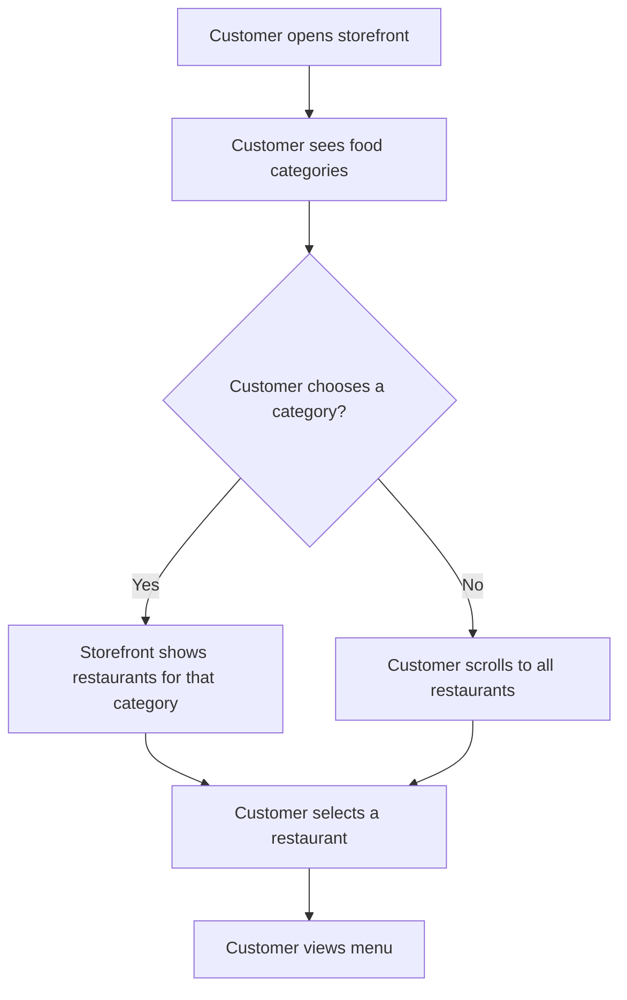

# Category-First Storefront User Flow

## Flow

## Recovery Paths

- If a selected category has no restaurants, show an empty state with a route back to all restaurants.
- If categories fail to load, keep the restaurant list usable.
