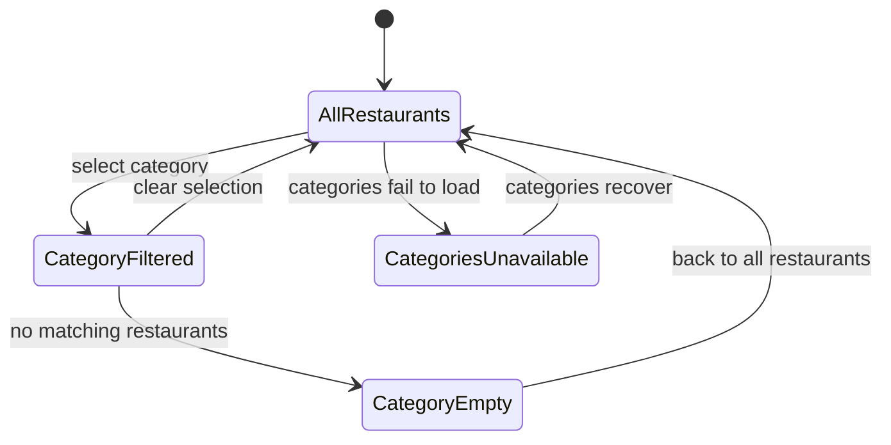

# Model: Category Selection States

## Purpose

The legal states of storefront discovery as FD-SPEC-001 requires them, so every branch — including the failure and empty branches a customer rarely walks — is enumerated once and reviewed for completeness.

## Diagram

## Rules

- `AllRestaurants` is the initial state and must be reachable from every other state in one step (FD-SPEC-001: a visible way back to the unfiltered list).
- `CategoriesUnavailable` keeps the restaurant list usable; only the category section is missing.
- Entering `CategoryFiltered` preserves the current delivery context.

## Exclusions

Visual styling (design system) and restaurant ranking are out of scope; the customer's path through these states is narrated in FD-FLOW-001.
