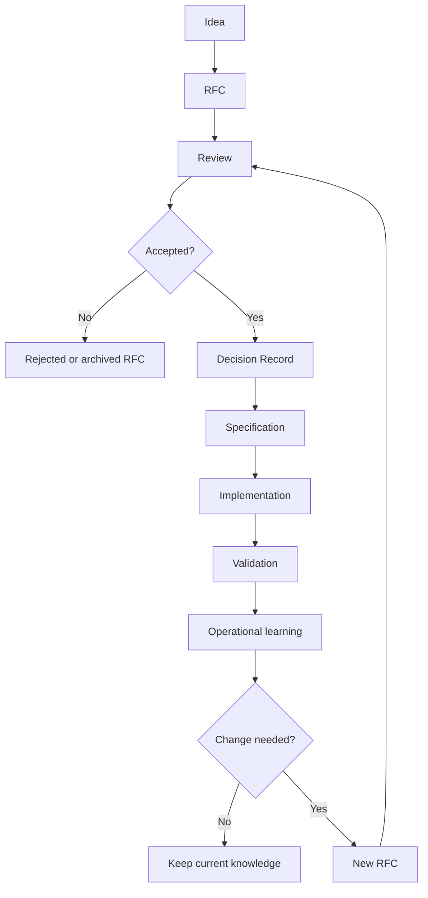

# Knowledge Evolution Lifecycle

## Flow

## Notes

Operational learning can update a spec, create a playbook, or trigger a new RFC. Use a new RFC when the learning changes product behavior, cross-domain contracts, or a prior decision.

