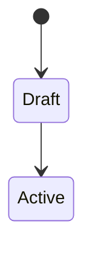

# Model: <Title>

<!-- Primary question: What states, entities and transitions exist? -->

## Purpose

<!-- Name the system concept this model describes and which spec or decision it serves. -->

## Diagram

<!-- Required. Use a Mermaid stateDiagram-v2, classDiagram, or erDiagram. -->

## Rules

<!-- Conditions attached to transitions or relations: actor, required data, invariants. Keep the diagram readable; put conditions here. -->

## Exclusions

<!-- Name what this model does not cover and where that lives. -->
