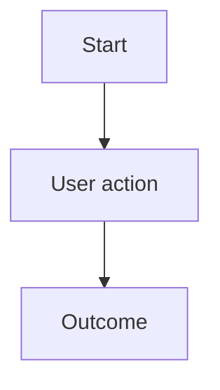

# User Flow: <Title>

<!-- Primary question: How does a user move through a product capability? -->

```yaml
---
id: FLOW-NNN
title: <Title>
status: current
created: YYYY-MM-DD
updated: YYYY-MM-DD
authors: [<name-or-team>]
tags: []
related: []
---
```

## Flow

<!-- Use Mermaid when sequence or branching matters. -->



## Notes

<!-- Capture edge cases or recovery paths. Keep behavior details in specs. -->

